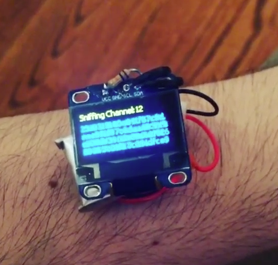

## Synopsis

This repository contains the source code to build a packet-sniffing wristwatch, using the wifi-enabled [ESP8266](http://www.esp8266.com/) microcontroller and an [SSD1306](https://www.adafruit.com/datasheets/SSD1306.pdf) OLED LCD module.

## Motivation

Data is all around us.  This project aims to leverage the power of wearable technology to demonstrate the sheer magnitude of information traveling over the airwaves.

## Materials

- [ESP8266 WiFi-Enabled Microcontroller](http://www.amazon.com/Diymall-Esp8266-Serial-Wireless-Transceiver/dp/B00O34AGSU/ref=sr_1_1?ie=UTF8&qid=1432166270&sr=8-1&keywords=esp8266)
- [SSD1306 i2c 128x64 pixel OLED display](http://www.amazon.com/Diymall-Yellow-Serial-Display-Arduino/dp/B00O2LLT30/ref=sr_1_2?ie=UTF8&qid=1432166290&sr=8-2&keywords=ssd1306)
- [Adafruit LiPo battery w/ charger](http://www.amazon.com/Adafruit-Micro-Lipo-MicroUSB-Jack/dp/B00SK8JWQM/ref=sr_1_4?ie=UTF8&qid=1432166322&sr=8-4&keywords=adafruit+lipo)
- [USB to TTL Serial UART (for programming the ESP)](http://www.amazon.com/KEDSUM%C2%AE-CP2102-Module-Download-Converter/dp/B009T2ZR6W/ref=sr_1_2?ie=UTF8&qid=1432166411&sr=8-2&keywords=usb+to+uart)

## How does it work?

Using the native [ESP8266 SDK](https://github.com/pfalcon/esp-open-sdk), the application scans for open wifi networks.  After enabling promiscuous mode, the application listens for packets and displays everything it recieves on an attached OLED display.  The microcontroller uses a bit-banged i2c driver to communicate with the display via its GPIO pins, since it lacks built-in i2c communication.

## What does it look like?

There's also a video of the watch in operation [here](assets/video.mp4).

## Next steps

While the form factor of the project is small, it needs a durable enclosure to be worn on the wrist reliably.  Furthermore, the project needs the appropriate battery regulation circuitry to avoid damage to the LiPo battery- depleting the voltage too far (below 3.7v) will damage the cells.

## License

This project is convered under the [MIT license] .